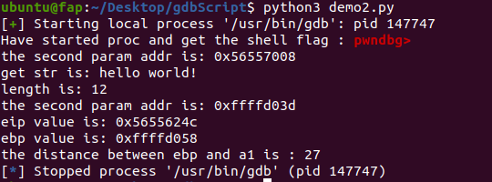

## GDBDebug
封装后的GDBDebug代码：
```python
from pwn import *
import time
import re

class GDBDebug:
    def __init__(self, command):
        self.proc = process(command)
        time.sleep(0.8)
        self.shellFlag = self.proc.recv().split(b'\n')[-1]
        print("Have started proc and get the shell flag :", self.shellFlag.decode())
        self.firstSend = True
        self.getHexNumPattern = r'(0x[0-9a-fA-F]+)'
        self.getStrPattern =  r'\"(.*?)\"'
	
    def sendCmd(self, byte_data):
        if self.firstSend:
            self.proc.sendline(byte_data)
            self.firstSend = False
        else:
            self.proc.sendlineafter(self.shellFlag, byte_data)
    
    def recvAll(self):
        return self.proc.recv()
    
    def recvline(self):
        return self.proc.recvline()
    
    def getWDataByAddr(self, addr):
        if type(addr) is str:
            addr = addr.encode()
        elif isinstance(addr, int):
            addr = hex(addr).encode()
        self.proc.sendlineafter(self.shellFlag, b"x/wx " + addr)
        res = self.proc.recvline()
        # b'\x1b[34m0xffffd024\x1b[m:\t0x56557008\n'
        data = re.findall(self.getHexNumPattern, res.decode())
        if len(data) < 2:
            return None
        return int(data[1], 16)
    
    def getStrByAddr(self, addr):
        if type(addr) is str:
            addr = addr.encode()
        elif isinstance(addr, int):
            addr = hex(addr).encode()
        self.proc.sendlineafter(self.shellFlag, b"x/s " + addr)
        res = self.proc.recvline()
        # b'\x1b[34m0x56557008\x1b[m:\t"hello world!"\n'
        data = re.findall(self.getStrPattern, res.decode())
        if not data:
            print("can't get string value")
            return None
        return data[0]
    
    def getReg(self, reg):
        if type(reg) is str:
            reg = reg.encode()
        self.proc.sendlineafter(self.shellFlag, b"info registers " + reg)
        res = self.proc.recvline()
        reg_value = re.findall(self.getHexNumPattern, res.decode())
        if not reg_value:
            return None
        return int(reg_value[0], 16)
```

test：
```python
cmd = ["gdb", "-q", "./test"]
gdb = GDBDebug(cmd)
gdb.sendCmd(b'b *0x5655624c')
gdb.sendCmd(b"r")

# get second param 
a2_addr = gdb.getWDataByAddr("$esp+4")
print("the second param addr is:", hex(a2_addr))

# get param2 string value
str_str = gdb.getStrByAddr(a2_addr)
print("get str is:", str_str)
print("length is:", len(str_str))

# get first param 
a1_addr = gdb.getWDataByAddr("$esp")
print("the second param addr is:", hex(a1_addr))

# get register eip
eip = gdb.getReg('eip')
print("eip value is:", hex(eip))

# get register ebp
ebp = gdb.getReg('ebp')
print("ebp value is:", hex(ebp))

print("the distance between ebp and a1 is :", ebp - a1_addr)
```

test程序：
```c
#include <stdio.h>
#include <string.h>

int main()
{
    char *a = "hello world!";
    char b[15];
    strcpy(b, a);
    printf("%s\n", b);
    printf("good bye!\n");
    return 0;
}
```

运行结果：


原始代码：
```python
p = process(["gdb", "-q", "./test"])
time.sleep(0.8)

shellFlag = p.recv().split(b'\n')[-1]
print(shellFlag.decode())

p.sendline(b'b *0x5655624c')

p.sendlineafter(shellFlag, b"r")

# get second param address
p.sendlineafter(shellFlag, b"x/wx $esp+4")
res = p.recvline()
# b'\x1b[34m0xffffd024\x1b[m:\t0x56557008\n'
getHexNumPattern = r'(0x[0-9a-fA-F]+)'
addr = re.findall(getHexNumPattern, res.decode())
str_addr = int(addr[1], 16)
print(addr)
# ['0xffffd024', '0x56557008']
print(hex(str_addr))
# 0x56557008

# get string value
p.sendlineafter(shellFlag, ("x/s {}".format(hex(str_addr))).encode())
res = p.recvline()
# b'\x1b[34m0x56557008\x1b[m:\t"hello world!"\n'
print(res.decode())

getStrPattern =  r'\"(.*?)\"'
match = re.findall(getStrPattern, res.decode())
# ['hello world!']
if not match:
    print("can't get string value")
    exit(0)
str_str = match[0]
print(str_str)
print("string's length is : ",len(str_str))

# get register eip
p.sendlineafter(shellFlag, b"info registers $eip")
res = p.recvline()
show_eip = re.findall(getHexNumPattern, res.decode())
eip_value = int(show_eip[0], 16)
print(hex(eip_value))

# get first param addr
p.sendlineafter(shellFlag, b"x/wx $esp")
res = p.recvline()
# b'\x1b[34m0xffffd024\x1b[m:\t0x56557008\n'
getHexNumPattern = r'(0x[0-9a-fA-F]+)'
addr = re.findall(getHexNumPattern, res.decode())
a1_addr = int(addr[1], 16)
print(addr)
# ['0xffffd024', '0x56557008']
print("the first param's addr: ", hex(a1_addr))
# 0x56557008

# get ebp value
p.sendlineafter(shellFlag, b"info registers $ebp")
res = p.recvline()
show_eip = re.findall(getHexNumPattern, res.decode())
ebp_value = int(show_eip[0], 16)
print("ebp value is : ", hex(ebp_value))

print(gdb.recvAll().decode())
```

## 简化流程
```python
from pwn import *
from GDBDebug import GDBDebug
import subprocess
import time
import re

workplace = '/home/ubuntu/Desktop/rootCause/demo/cve_2018_5767'

# start http server
runCmd = 'sudo chroot /home/ubuntu/Desktop/rootCause/demo/cve_2018_5767 ./fire ./shellphish-qemu-linux-arm -c /home/ubuntu/Desktop/rootCause/demo/cve_2018_5767 -d nochain,exec,page,strace -D /tmp/trace.txt -- tdhttpd'.split()
# print(runCmd)
runProc = subprocess.Popen(runCmd, stdout=subprocess.PIPE, stderr=subprocess.PIPE)

if runProc.poll() is not None:
    print("[error] can't start server successfully..exit")
    exit(0)

time.sleep(5)

# send poc
pocCmd = 'python3 /home/ubuntu/Desktop/rootCause/demo/cve_2018_5767/poc.py'.split()
pocProc = subprocess.Popen(pocCmd, stdout=subprocess.PIPE, stderr=subprocess.PIPE)
pocProc.wait()
print("Return code:", pocProc.returncode)

time.sleep(2)

# close runProc
if runProc.poll() is None:
    print("server not crash..")
    print("stop process..")
    runProc.terminate()
    runProc.wait()
    print("finished")
else:
    returnCode = runProc.returncode
    print(returnCode)

# analysis trace
traceAddrPattern = r'\[[0-9a-fA-F]+/([0-9a-fA-F]+)/'
siAddrPattern = r'si_addr=(0x[0-9a-fA-F]+)'
with open(workplace + '/tmp/trace.txt', 'rb') as fr:
    filter_trace=[]
    for line in fr:
        if b'Trace' in line:
            match = re.search(traceAddrPattern, line.decode())
            if not match:
                continue
            trace_data = match.group(1)
            if trace_data[:2] == '00':
                filter_trace.append(trace_data)
        elif b'si_addr' in line:
            match = re.search(siAddrPattern, line.decode())
            if not match:
                continue
            si_addr = match.group(1)

# print(len(filter_trace))
# print(filter_trace[-1])
# print(si_addr)

# save result
with open(workplace + '/tmp/filter_trace.txt', 'w') as fw:
    for line in filter_trace:
        fw.write(line + '\n')
    fw.write(si_addr)
print("saved filter result to file")

# read trace from filter_trace.txt
with open(workplace + '/tmp/filter_trace.txt', 'r') as fr:
    trace_data = fr.read().splitlines()

si_addr = trace_data[-1]
trace_data = trace_data[:-1]

# get danger func plt addr
elf = ELF(workplace + '/tdhttpd')
plt_section = elf.get_section_by_name('.plt')
plt_start = plt_section.header.sh_addr
plt_end = plt_start + plt_section.header.sh_size
print(hex(plt_start), hex(plt_end))

sscanf_plt = elf.plt['sscanf']
sscanf_addr = hex(sscanf_plt)[2:].zfill(8)
print("sscanf plt addr is:", sscanf_addr)
# 0000dfe0

# get breakpoint addr
indexes = [i for i, x in enumerate(trace_data) if x == sscanf_addr]
hitNum = len(indexes)
print(indexes)
brk_list = []

for index in indexes:
    for i in range(1,4):
        if index+i >= len(trace_data):
            break
        cur_addr = int(trace_data[index + i], 16)
        if cur_addr >= plt_start and cur_addr <= plt_end:
            continue
        if hex(cur_addr-4) not in brk_list:
            brk_list.append(hex(cur_addr-4))
        break
# TODO not vertify the addr actually is sscanf callsite

# brk_list = [hex(int(trace_data[index+1], 16) - 4) for index in indexes]
print(brk_list)

brk_cmds = []
# print(brk_list)0x407ffb8c
for brk in brk_list:
    brk_cmds.append("b *" + brk)
print('brk_cmds:', brk_cmds)

# 1.start server and 2.attach gdb, then 3.set brk point one by one 4.run 5.send poc
# 6.check brk point(a.hit addr in brk_dic b.is pc value equal si_addr--yes?hit_addr-4:continue r)

# start http server
debugCmd = 'sudo chroot /home/ubuntu/Desktop/rootCause/demo/cve_2018_5767 ./shellphish-qemu-linux-arm -g 1234 tdhttpd'.split()
# print(runCmd)
debugProc = subprocess.Popen(debugCmd, stdout=subprocess.PIPE, stderr=subprocess.PIPE)
if debugProc.poll() is not None:
    print("[error] can't start server successfully..exit")
    exit(0)

gdbCmd = ('gdb-multiarch -q ' + workplace + '/tdhttpd').split()
gdb = GDBDebug(gdbCmd)
gdb.sendCmd('set sysroot ' + workplace + '/')
gdb.sendCmd('target remote :1234')
print('attached')
for brk_cmd in brk_cmds:
    gdb.sendCmd(brk_cmd)
print('set break points')
gdb.sendCmd('c')
print('start run')
time.sleep(1)

# send poc
pocCmd = 'python3 /home/ubuntu/Desktop/rootCause/demo/cve_2018_5767/poc.py'.split()
pocProc = subprocess.Popen(pocCmd, stdout=subprocess.PIPE, stderr=subprocess.PIPE)
time.sleep(1)

print('had send poc')

# print(gdb.recvAll().decode())

for i in range(hitNum):
    while True:
        line = gdb.recvline()
        if b'Breakpoint' in line:
            break
        print(line.decode())

    hit_point = gdb.getReg('pc')
    print('hit point: ', hex(hit_point))

    r11_value = gdb.getReg('r11')
    r0_value = gdb.getReg('r0')
    r1_value = gdb.getReg('r1')
    r2_value = gdb.getReg('r2')
    print('r11 value: ', hex(r11_value))
    print('r0 value: ', hex(r0_value))
    print('r1 value: ', hex(r1_value))
    print('r2 value: ', hex(r2_value))

    buf_offset = r11_value - r2_value
    print('distance between r2 and r11 is:', hex(buf_offset))
    r0_str = gdb.getStrByAddr(r0_value)
    str_len = len(r0_str)
    print(r0_str)
    print(str_len)

    if buf_offset < str_len:
        print("danger site!!", hex(hit_point))

    gdb.sendCmd('n')
    pc_value = gdb.getWDataByAddr(r11_value)
    pc_value = pc_value - pc_value%4
    print('pc value is:', hex(pc_value))
    if pc_value == int(si_addr, 16):
        print('here is the root cause site:', hex(hit_point))
        break

# print(gdb.recvAll())

gdb.sendCmd('q')

# b *0x2dd44
# 0x407ffb60:	0x65616162

# if debugProc.poll() is None:
#     print("close debug process..")
#     debugProc.terminate()
#     debugProc.wait()
#     print("closed")


'''
*R0   0x3fddf017 ◂— cmnvc r3, #112, #2 /* 0x73736170 */
*R1   0xb3ce0 ◂— vnmlspl.f32 s5, s22, s11 /* '%*[^=]=%[^;];*' */
*R2   0x407ff9cc ◂— 0
*R3   0x407ff9cc ◂— 0
*R4   0xd23ac —▸ 0xd226c ◂— 1
*R5   0xed440 ◂— strbtvs r6, [pc], -pc, lsr #14 /* 0x666f672f; '/goform/xxx' */
*R6   0x1
*R7   0x40800789 ◂— strbtvc r6, [r8], #-0x474 /* 0x74686474; 'tdhttpd' */
*R8   0xd938 (_init) ◂— mov ip, sp
*R9   0x2cea8 ◂— push {r4, fp, lr}
*R10  0x408005d8 ◂— 0
*R11  0x407ffb8c —▸ 0x16b94 ◂— mov r3, r0
*R12  0x3d
*SP   0x407ff6c8 ◂— 0
*PC   0x2dd44 (R7WebsSecurityHandler+1376) ◂— bl #0xdfe0

 ► 0x2dd44 <R7WebsSecurityHandler+1376>    bl     #sscanf@plt                       <sscanf@plt>
        s: 0x3fddf017 ◂— 0x73736170 ('pass')
        format: 0xb3ce0 ◂— '%*[^=]=%[^;];*'
        vararg: 0x407ff9cc ◂— 0

set print elements 0


sp + 0x304 + 0x1c0 +4
or 0x407ff9cc + 0x1c0 +4

'''

```

输出结果：
```bash
ubuntu@fap:~$ /bin/python3 /home/ubuntu/Desktop/rootCause/test.py
Return code: 1
-11
saved filter result to file
[*] '/home/ubuntu/Desktop/rootCause/demo/cve_2018_5767/tdhttpd'
    Arch:     arm-32-little
    RELRO:    No RELRO
    Stack:    No canary found
    NX:       NX enabled
    PIE:      No PIE (0x8000)
0xd948 0xe49c
sscanf plt addr is: 0000dfe0
[57809]
['0x2dd44']
brk_cmds: ['b *0x2dd44']
[+] Starting local process '/usr/bin/gdb-multiarch': pid 178630
Have started proc and get the shell flag : pwndbg> 
attached
set break points
start run
had send poc
Continuing.


hit point:  0x2dd44
r11 value:  0x407ffb8c
r0 value:  0xf1167
r1 value:  0xb3ce0
r2 value:  0x407ff9cc
distance between r2 and r11 is: 0x1c0
password=aaaabaaacaaadaaaeaaafaaagaaahaaaiaaajaaakaaalaaamaaanaaaoaaapaaaqaaaraaasaaataaauaaavaaawaaaxaaayaaazaabbaabcaabdaabeaabfaabgaabhaabiaabjaabkaablaabmaabnaaboaabpaabqaabraabsaabtaabuaabvaabwaabxaabyaabzaacbaaccaacdaaceaacfaacgaachaaciaacjaackaaclaacmaacnaacoaacpaacqaacraacsaactaacuaacvaacwaacxaacyaaczaadbaadcaaddaadeaadfaadgaadhaadiaadjaadkaadlaadmaadnaadoaadpaadqaadraadsaadtaaduaadvaadwaadxaadyaadzaaebaaecaaedaaeeaaefaaegaaehaaeiaaejaaekaaelaaemaae
461
danger site!! 0x2dd44
pc value is: 0x6561616c
here is the root cause site: 0x2dd44
close debug process..
```

## todo
1.断点下在危险函数下一个地址，获取r11进而获取覆盖的pc即\[r11]，通过判断覆盖pc与trace最后pc是否一致。

2.模拟环境启动和poc发送封装
