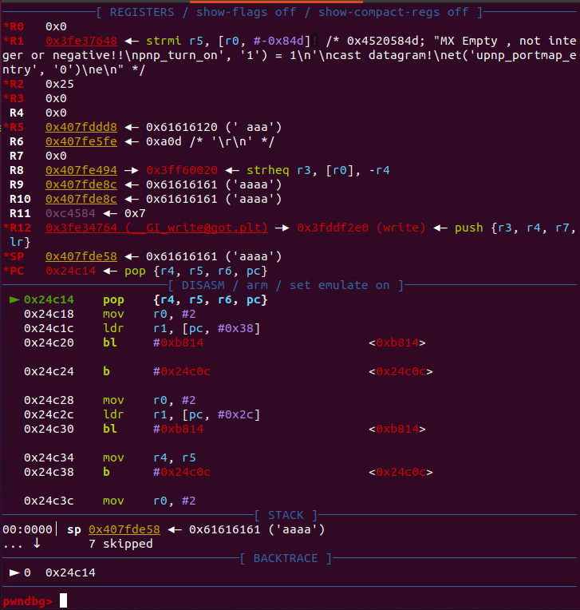
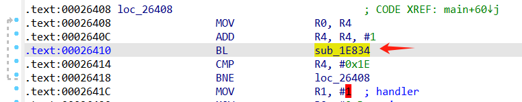
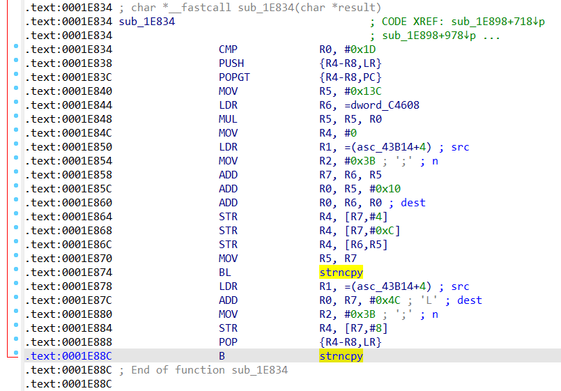

### 问题1.栈上变量距bp偏移获取
对arm架构，单纯的r11并不总是执行栈上保存pc的地址，所以原来的方法并不总是有效，还是得通过静态分析确定栈上变量距离bp的偏移。



在ida反编译界面中，有关于局部缓冲区变量距离sp和bp的偏移的注解，我尝试通过api来获取这个值，但尝试寻找了很久都没有找到如何获取距离bp的偏移，只能够获得距离sp的偏移。

我注意到，距离sp的偏移+距离bp的偏移似乎总等于一个定值，在ida api中存在一个函数`get_frame_size()`可以获得栈帧大小，经过观察发现，大部分情况下这个定值与获取的栈帧大小一样，但是依然存在一些情况这两个值不同，这可能是静态分析并不总是准去的问题，因此用这种方法依然不能总是准确的获取bp偏移。

最终只能使用最简单的方法，通过python正则表达式从IDA反编译结果字符串中直接搜素提取出关于sp和bp的偏移。

```python
import idaapi
import re
func = 0x24B74
lvar_name = 'v6'

confidence = 0
cfunc = idaapi.decompile(func)
lvars = cfunc.get_lvars()
for var in lvars:
    if var.name == lvar_name:
        lvar = var
print(lvar.name)
print(lvar.type())
print(lvar.width)
stkoff = lvar.get_stkoff()
print('stkoff:', stkoff)
# print(dir(lvar))

frame_size = get_frame_size(func)
print('frame size:', frame_size)
pattern = r"\[sp\+(\d+)h\] \[bp\-(\d+)h\]"
dec_list = str(cfunc).split('\n')
for line in dec_list:
    if lvar_name in line and '//' in line:
        print(line)
        matches = re.search(pattern, line)
        sp_off = int(matches.group(1), 16)
        bp_off = int(matches.group(2), 16)
        print(sp_off, hex(bp_off))
        if sp_off == stkoff:
            confidence += 1
        if sp_off + bp_off == frame_size:
            confidence += 1
        print('confidence: ', confidence)
        break
```

### 问题2.危险函数调用点位置获取
单纯的使用trace中危险函数调用地址的下一个地址-4并不能得到危险函数调用点地址。存在两种特殊情况：
1. 在第一次调用危险函数时，由于延迟加载，会再跳到plt某地址处，因此trace中是plt节地址，而不是危险函数调用点的下一个指令地址
2. 当危险函数指令调用位于函数末尾时，它的下一条指令地址是函数调用处的下一条指令地址，而不是危险函数调用处的下一条指令地址。

针对第2种情况，如下图所示。在0x26410位置跳到了sub_1E834去执行。



而sub_1E834的最后一条指令是B strncpy



当执行完危险函数strncpy的调用后，程序会返回到sub_1E834调用处的下一条指令地址，即0x26414，而不是我们所希望的strncpy调用的+4的地址(0x1E88C+4)。

```
0001e878  # strncpy调用前未跳转块起始地址
0000af80  # strncpy函数plt地址
00026414  # 另一个函数调用点后地址
```

通过直接下一条地址直接减4的方法并不总是能够得到危险函数调用地址。

对于情况1，可以设置从危险函数调用点开始向下遍历到第一个.text节地址（向下不超过2个）再进行类似减4的操作。

对于情况2，我们首先获取危险函数调用点后的.text的地址处-4（即函数调用点）的操作数（即调用的函数），判断其是否为危险函数，若是则直接保存；若不是，则获取该调用函数的最后一条指令地址，并判断操作数是否为危险函数地址，若是则保存最后一条指令地址为调用点。

最终代码如下：
```python
import idautils

trace_file = r'E:\项目\根因分析\filter_trace.txt'

danger_func_lists = [['strcpy'], ['strncpy', 'memcpy'], ['ssprintf'], ['sscanf']]
danger_func_addr_list = []

with open(trace_file, 'r') as fr:
    trace_data = fr.read().splitlines()

si_addr = int(trace_data[-1], 16)
trace_data = [int(x, 16) for x in trace_data[:-1]]

for danger_func_list in danger_func_lists:
    for danger_func_name in danger_func_list:
        func_addr = idc.get_name_ea(idc.BADADDR, danger_func_name)
        if func_addr != idc.BADADDR:
            danger_func_addr_list.append(func_addr)
print('danger func addr list: {}'.format([hex(x) for x in danger_func_addr_list]))

for seg in idautils.Segments():
    if SegName(seg) == ".text":
        text_start = SegStart(seg)
        text_end = SegEnd(seg)
        break

print("plt section between {} and {}".format(hex(plt_start), hex(plt_end)))

index = 0
trace_len = len(trace_data)
danger_func_call_sites = []
while index < trace_len:
    if trace_data[index] not in danger_func_addr_list:
        index += 1
        continue
    # 调用了危险函数，寻找它的text段下一条指令地址从而-4推断它的调用地址
    i = 1
    while i<=2:
        if index+i >= trace_len:
            break
        cur_addr = trace_data[index + i]
        if cur_addr < text_start and cur_addr >= text_end:
            continue
        # .text段地址
        last_call_addr = cur_addr - 4
        call_addr = get_operand_value(last_call_addr, 0)
        if call_addr in danger_func_addr_list:
            if last_call_addr not in danger_func_call_sites:
                danger_func_call_sites.append(last_call_addr)
        else:
            # 获取调用函数的最后一条地址并判断是否为危险调用
            callee_func_last_addr = find_func_end(call_addr) - 4
            if get_operand_value(callee_func_last_addr, 0) in danger_func_addr_list:
                if callee_func_last_addr not in danger_func_call_sites:
                    danger_func_call_sites.append(callee_func_last_addr)
        break
        i += 1
    index += i + 1
    
    
print([hex(x) for x in danger_func_call_sites])

```

### 问题3.工具静态分析部分识别结果不准确
memcpy会反汇编为strcpy(Target's Ea会为无效，Is helper会为True)

字符串没有识别为"string"，而是"ref"

#### 案例1.未识别的字符串
upnpd的0x24694位置存在`memcpy(&a2[v11], "\r\n", 3u);`，该处的汇编代码如下图所示。


第二个参数字符串保存在R1中，即表示为(aExt+4)。当使用FIDL进行识别时，识别的内容如下：

```
Ea: 24694
Target's Name: memcpy
Target's Ea: AAE8
Target's ret: void *
Is helper: False
Is indirect: False
Args:
 - 0: Rep(type='ref', val=<ida_hexrays.cexpr_t; proxy of <Swig Object of type 'cexpr_t *' at 0x0000021936A40630> >)
 - 1: Rep(type='ref', val=<ida_hexrays.cexpr_t; proxy of <Swig Object of type 'cexpr_t *' at 0x0000021936A40840> >)
 - 2: Rep(type='number', val=3)
```

它将第二个参数识别为ref类型，val是ida_hexrays.cexpr_t对象。

```python
import FIDL.decompiler_utils as du
import ida_hexrays

addr = 0x24694
cf = du.controlFlowinator(ea=addr, fast=False)

for cf_call in cf.calls:
    if cf_call.ea == addr:
        scall = cf_call
        break

print(scall)

params = scall.args
expr = params[1].val
print(expr)  # <ida_hexrays.cexpr_t; proxy of <Swig Object of type 'cexpr_t *' at 0x0000021936546580> >
print(expr.op)  # 58 ida_hexrays.cot_idx  索引类型
print(expr.x.op)  # 64 ida_hexrays.cot_obj  索引对象
print(expr.x.type)  # char[7]
print(expr.y.op)  # 61 ida_hexrays.cot_num  索引值
print(expr.y.n)  # <ida_hexrays.cnumber_t; proxy of <Swig Object of type 'cnumber_t *' at 0x000002193B451830> >
print(expr.y.n._value)  # 4
print(expr.y.type) # int

string_val = idc.get_strlit_contents(expr.x.obj_ea + expr.y.n._value)
print(string_val) # '\r\n'  ('EXT:\r\n'第4位开始)
```
#### 案例2.参数为ref类型--栈上变量索引的引用
代码：`memcpy(&a2[v11], "\r\n", 3u);`

对于第一个参数`&a2[v11]`，FIDL识别的为ref类型
```
 - 0: Rep(type='ref', val=<ida_hexrays.cexpr_t; proxy of <Swig Object of type 'cexpr_t *' at 0x0000021936A40630> >)
```

ida_hexray的相关信息如下：
```python
params = scall.args
expr = params[0].val
print(expr) # <ida_hexrays.cexpr_t; proxy of <Swig Object of type 'cexpr_t *' at 0x0000021936883330> >
print(expr.op) # ida_hexrays.cot_idx 58
print(expr.x) # <ida_hexrays.cexpr_t; proxy of <Swig Object of type 'cexpr_t *' at 0x0000021936953300> >
print(expr.x.op) # 65 ida_hexrays.cot_var
print(expr.x.type) # char*
print(expr.x.v) # <ida_hexrays.var_ref_t; proxy of <Swig Object of type 'var_ref_t *' at 0x000002193B502820> >
print(expr.x.v.getv().name) # a2
print(expr.x.v.idx) # 1

print(expr.y) # <ida_hexrays.cexpr_t; proxy of <Swig Object of type 'cexpr_t *' at 0x000002193B473E10> >
print(expr.y.op) # 65 ida_hexrays.cot_var
print(expr.y.type) # size_t
print(expr.y.v.getv()) # <ida_hexrays.lvar_t; proxy of <Swig Object of type 'lvar_t *' at 0x00000219369AF300> >
print(expr.y.v.getv().name) # v11
```

#### 案例3.参数为ref类型--栈上变量引用
代码：`strncpy((char *)&v32, v6, 0x13u);`

FIDL识别信息如下，第一个参数识别为ref。

```
Ea: DA28
Target's Name: strncpy
Target's Ea: AF80
Target's ret: char *
Is helper: False
Is indirect: False
Args:
 - 0: Rep(type='ref', val=<ida_hexrays.cexpr_t; proxy of <Swig Object of type 'cexpr_t *' at 0x000002193C0531E0> >)
Name: v6
  Type name: const char *
  Size: 4
  Pointed object: const char
 - 1: Rep(type='var', val=)
 - 2: Rep(type='number', val=19)
```

```python
import FIDL.decompiler_utils as du
import ida_hexrays

addr = 0xda28
cf = du.controlFlowinator(ea=addr, fast=False)

for cf_call in cf.calls:
    if cf_call.ea == addr:
        scall = cf_call
        break
#print(scall)

params = scall.args
expr = params[0].val
print(params[0].type) #ref
print(expr) # <ida_hexrays.cexpr_t; proxy of <Swig Object of type 'cexpr_t *' at 0x0000021936A1DC50> >
print(expr.op) # 65 ida_hexrays.cot_var
print(expr.v.getv().name) # v32
```

#### 案例4.参数为ref类型-全局变量引用
```c
strncpy((char *)&dword_C4608[79 * (_DWORD)result + 4], "", 0x3Bu);
```

```
Ea: 1E874
Target's Name: strncpy
Target's Ea: AF80
Target's ret: char *
Is helper: False
Is indirect: False
Args:
 - 0: Rep(type='ref', val=<ida_hexrays.cexpr_t; proxy of <Swig Object of type 'cexpr_t *' at 0x000002193C061530> >)
 - 1: Rep(type='ref', val=<ida_hexrays.cexpr_t; proxy of <Swig Object of type 'cexpr_t *' at 0x000002193C060DE0> >)
 - 2: Rep(type='number', val=59)
```

```python
import FIDL.decompiler_utils as du
import ida_hexrays

addr = 0x1E874
cf = du.controlFlowinator(ea=addr, fast=False)

for cf_call in cf.calls:
    if cf_call.ea == addr:
        scall = cf_call
        break

print(scall)

params = scall.args
expr = params[0].val
print(expr.op) # 58 ida_hexrays.cot_idx
print(expr.x.op) # 64 ida_hexrays.cot_obj
print(expr.x.type) # int[]
print(hex(expr.x.obj_ea)) # 0xc4608
print(expr.y.op) # 35 cot_add
print(expr.y.x.op) # 37 cot_mul
print(expr.y.x.x.op) # 61 cot_num
print(expr.y.x.x.n._value) # 79
print(expr.y.x.y.op) # 48 cot_cast
print(expr.y.x.y.x.op) # 65 cot_var
print(expr.y.x.y.x.type) # char *
print(expr.y.x.y.x.v.getv().name) # result
print(expr.y.x.y.type) # _DWORD
print(expr.y.y.op) # 61 cot_num
print(expr.y.y.n._value) # 4
print('-------param1----------')
expr1 = params[1].val
print(expr1.op) # 58 ida_hexrays.cot_idx
print(expr1.x.op) # 64 ida_hexrays.cot_obj
print(expr1.x.type) # const char []
print(hex(expr1.x.obj_ea)) # 0xc4608
print(idc.get_strlit_contents(expr1.x.obj_ea)) # b'\r\n\r\n'
print(expr1.y.op) # 61 ida_hexrays.cot_num
print(expr1.y.n._value) # 4
print(idc.get_strlit_contents(expr1.x.obj_ea + expr1.y.n._value)) # None
```

#### 问题4.危险函数调用参数由上层函数传递过来

```python
import FIDL.decompiler_utils as du
import idautils

trace_file = r'E:\项目\根因分析\filter_trace.txt'

## 开始分析，读取过滤后的trace数据
with open(trace_file, 'r') as fr:
    trace_data = fr.read().splitlines()


si_addr = int(trace_data[-1], 16)
trace_data = [int(x, 16) for x in trace_data[:-1]]

# 获取地址空间
for seg in idautils.Segments():
    if SegName(seg) == ".text":
        text_start = SegStart(seg)
        text_end = SegEnd(seg)
    elif SegName(seg) == ".plt":
        plt_start = SegStart(seg)
        plt_end = SegEnd(seg)

print(".text: {}~{}".format(hex(text_start), hex(text_end)))

call_back_map = {}

def isFunctionStart(ea):
    func = ida_funcs.get_func(ea)
    return func is not None and func.startEA == ea

index = 0
trace_len = len(trace_data)
while index < trace_len:
    if trace_data[index] < text_start and trace_data[index] >= text_end:
        index += 1
        continue
    addr = trace_data[index]
    mnem = GetMnem(addr)            
    if mnem not in ['BL', 'B', 'BLX']:
        pre_addr = PrevHead(trace_data[index])
        if GetMnem(pre_addr) in ['BL', 'B', 'BLX']:
            addr = pre_addr
        else:
            index += 1
            continue
    operand = get_operand_value(addr, 0)
    if operand >= text_start and operand < text_end and isFunctionStart(operand):
        if hex(operand) not in call_back_map:
            call_back_map[hex(operand)] = [hex(addr)]
        elif hex(addr) not in call_back_map[hex(operand)]:
            call_back_map[hex(operand)].append(hex(addr))
    index += 1

print(call_back_map)
print(call_back_map.keys())
```

思路是尝试构建反向调用关系映射，当使用从上层传来的参数时，获取上层函数和调用点，解析相应的位置参数。

### 20231218 现存的问题
#### 1.危险函数建模不完整
目前只有针对strcpy或strncpy的粗略的模型，但对sccsnf和ssprintf这样的还没有设计，这种函数的参数不确定，需要经过调查后精心设计。
#### 2.目标缓冲区变量信息提取不准确
##### 案例1：目标缓冲区参数为指针
对于Tenda的CVE-2018-5767案例中，漏洞点为一个sscanf。
```c
char *v40; // [sp+498h] [bp-2Ch]
if ( v40 )
	sscanf(v40, "%*[^=]=%[^;];*", v33);
```

对于这种类型的我们目前无法准确建模提取出v40的缓冲区大小，所能提取出来的信息则是它是一个指针，大小为4，仅根据此信息无法判断是否可能发生溢出。
```json
{'0x2dd44': {'func_name': 'sscanf', 'param0_name': 'v40', 'param0_size': 4, 'param0_type': 'char *'}}
```

对此的思路：通过对ida的反汇编代码通过正则表达式提取相关的据sp和bp来代替，但增加了分析的复杂度。

##### 案例2：目标缓冲区参数为局部变量偏移
对于目标缓冲区为某本地缓冲区偏移的情况，使用暂时的脚本也无法进行判断其缓冲区大小。
```c
int v14; // [sp+2Ch] [bp-10h]
memcpy((void *)(v14 + 18), va, 0xEu);
```
目前所能得到的有限信息为
```text
- 0: Rep(type='unk', val=<ida_hexrays.cexpr_t; proxy of <Swig Object of type 'cexpr_t *' at 0x00000288DEBCD5F0> >)
```
对此的思路：在上面ida反汇编提取bp和sp基础上，进行运算，得到运算后的距离bp距离大小，但需要进一步研究建模。

##### 案例3：目标缓冲区参数使用上层函数传递过来的参数
在这个案例中，memcpy的目标缓冲区为上层传递过来的参数a1，对此我们无法从当前函数内获取任何有关目标缓冲区的信息，并且这里还对a1进行了运算+8，增加了分析的困难。
```c
int __fastcall sub_18A18(int a1, char *a2, int a3)
{
	size_t n; // [sp+14h] [bp-8h]
	...
	memcpy(*(void **)(a1 + 8), a2, n);
	...
}
```

对此的思路：同问题3.问题4部分，基于Trace构建当前函数到上层调用点的映射关系Map，基于该Map就可以找到上层调用点的函数传入的参数，然后再在上层函数进一步分析。

思路可能遇到的困难：1.上层函数传入的参数依然为上层函数的上层函数传入的参数，如果要实现需要进行递归分析，增加了复杂度。2.可能还具有更加复杂的情况，如案例4。
##### 案例4：目标缓冲区参数使用上层函数传递过来的参数与本地变量的计算
此案例增加了案例3分析的复杂程度，这个案例不仅使用了上层函数传进来的参数，并且将其和本地变量进行了运算。
```c
# Tenda CVE-2018-5767环境 Ea: 0x194B4
int __fastcall sub_192E4(int a1, int a2, int a3)
{
	int v12; // [sp+18h] [bp-14h]
	int v14; // [sp+20h] [bp-Ch]
	size_t n; // [sp+24h] [bp-8h]
	...
	v14 = 0;
	while(1)
	{
		...
		memcpy((void *)(a2 + v14), *(const void **)(v12 + 4), n);
		...
		v14 += n;
	}
	...
}
```
#### 3.gdb动态运行部分
##### 采用二次运行代替一次运行方式
原来只进行一次运行，直接将trace提取出的所有危险调用点进行下断点，但实际上trace可以分为两部分，分为poc发送前和poc发生后。poc发生前的危险调用点对于我们的分析并没有用处，主要是在实现时会卡在前面的危险调用点，而无法触发poc引发的调用点，无法进行后续的分析。

因此首先来一次初次动态运行，将poc发送前的危险调用点从列表中清除，只剩下poc后的危险调用点。第二次动态运行时再设置断点。

此外，可以考虑设置2次静态分析，再第1次动态运行后，危险点数量减少，可以进行更加复杂的静态分析。

#### 待建模
```
snprintf  cve_2022_28972
ssprintf
sscanf
cmsUtl_strcpy  custom danger_func-like func
```

## 附录
