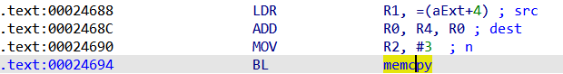

### 问题1.栈上变量距bp偏移获取
对arm架构，单纯的r11并不总是执行栈上保存pc的地址，所以原来的方法并不总是有效，还是得通过静态分析确定栈上变量距离bp的偏移。

在ida反编译界面中，有关于局部缓冲区变量距离sp和bp的偏移的注解，我尝试通过api来获取这个值，但尝试寻找了很久都没有找到如何获取距离bp的偏移，只能够获得距离sp的偏移。

我注意到，距离sp的偏移+距离bp的偏移似乎总等于一个定值，在ida api中存在一个函数`get_frame_size()`可以获得栈帧大小，经过观察发现，大部分情况下这个定值与获取的栈帧大小一样，但是依然存在一些情况这两个值不同，这可能是静态分析并不总是准去的问题，因此用这种方法依然不能总是准确的获取bp偏移。

最终只能使用最简单的方法，通过python正则表达式从IDA反编译结果字符串中直接搜素提取出关于sp和bp的偏移。

```python
import idaapi
import re
func = 0x24B74
lvar_name = 'v6'

confidence = 0
cfunc = idaapi.decompile(func)
lvars = cfunc.get_lvars()
for var in lvars:
    if var.name == lvar_name:
        lvar = var
print(lvar.name)
print(lvar.type())
print(lvar.width)
stkoff = lvar.get_stkoff()
print('stkoff:', stkoff)
# print(dir(lvar))

frame_size = get_frame_size(func)
print('frame size:', frame_size)
pattern = r"\[sp\+(\d+)h\] \[bp\-(\d+)h\]"
dec_list = str(cfunc).split('\n')
for line in dec_list:
    if lvar_name in line and '//' in line:
        print(line)
        matches = re.search(pattern, line)
        sp_off = int(matches.group(1), 16)
        bp_off = int(matches.group(2), 16)
        print(sp_off, hex(bp_off))
        if sp_off == stkoff:
            confidence += 1
        if sp_off + bp_off == frame_size:
            confidence += 1
        print('confidence: ', confidence)
        break
```

### 问题2.危险函数调用点位置获取
单纯的使用trace中危险函数调用地址的下一个地址-4并不能得到危险函数调用点地址。存在两种特殊情况：
1. 在第一次调用危险函数时，由于延迟加载，会再跳到plt某地址处，因此trace中是plt节地址，而不是危险函数调用点的下一个指令地址
2. 当危险函数指令调用位于函数末尾时，它的下一条指令地址是函数调用处的下一条指令地址，而不是危险函数调用处的下一条指令地址。

针对第2种情况，如下图所示。在0x26410位置跳到了sub_1E834去执行。


而sub_1E834的最后一条指令是B strncpy


当执行完危险函数strncpy的调用后，程序会返回到sub_1E834调用处的下一条指令地址，即0x26414，而不是我们所希望的strncpy调用的+4的地址(0x1E88C+4)。

```
0001e878  # strncpy调用前未跳转块起始地址
0000af80  # strncpy函数plt地址
00026414  # 另一个函数调用点后地址
```

通过直接下一条地址直接减4的方法并不总是能够得到危险函数调用地址。

对于情况1，可以设置从危险函数调用点开始向下遍历到第一个.text节地址（向下不超过2个）再进行类似减4的操作。

对于情况2，我们首先获取危险函数调用点后的.text的地址处-4（即函数调用点）的操作数（即调用的函数），判断其是否为危险函数，若是则直接保存；若不是，则获取该调用函数的最后一条指令地址，并判断操作数是否为危险函数地址，若是则保存最后一条指令地址为调用点。

最终代码如下：
```python
import idautils

trace_file = r'E:\项目\根因分析\filter_trace.txt'

danger_func_lists = [['strcpy'], ['strncpy', 'memcpy'], ['ssprintf'], ['sscanf']]
danger_func_addr_list = []

with open(trace_file, 'r') as fr:
    trace_data = fr.read().splitlines()

si_addr = int(trace_data[-1], 16)
trace_data = [int(x, 16) for x in trace_data[:-1]]

for danger_func_list in danger_func_lists:
    for danger_func_name in danger_func_list:
        func_addr = idc.get_name_ea(idc.BADADDR, danger_func_name)
        if func_addr != idc.BADADDR:
            danger_func_addr_list.append(func_addr)
print('danger func addr list: {}'.format([hex(x) for x in danger_func_addr_list]))

for seg in idautils.Segments():
    if SegName(seg) == ".text":
        text_start = SegStart(seg)
        text_end = SegEnd(seg)
        break

print("plt section between {} and {}".format(hex(plt_start), hex(plt_end)))

index = 0
trace_len = len(trace_data)
danger_func_call_sites = []
while index < trace_len:
    if trace_data[index] not in danger_func_addr_list:
        index += 1
        continue
    # 调用了危险函数，寻找它的text段下一条指令地址从而-4推断它的调用地址
    i = 1
    while i<=2:
        if index+i >= trace_len:
            break
        cur_addr = trace_data[index + i]
        if cur_addr < text_start and cur_addr >= text_end:
            continue
        # .text段地址
        last_call_addr = cur_addr - 4
        call_addr = get_operand_value(last_call_addr, 0)
        if call_addr in danger_func_addr_list:
            if last_call_addr not in danger_func_call_sites:
                danger_func_call_sites.append(last_call_addr)
        else:
            # 获取调用函数的最后一条地址并判断是否为危险调用
            callee_func_last_addr = find_func_end(call_addr) - 4
            if get_operand_value(callee_func_last_addr, 0) in danger_func_addr_list:
                if callee_func_last_addr not in danger_func_call_sites:
                    danger_func_call_sites.append(callee_func_last_addr)
        break
        i += 1
    index += i + 1
    
    
print([hex(x) for x in danger_func_call_sites])

```

### 问题3.工具静态分析部分识别结果不准确
memcpy会反汇编为strcpy(Target's Ea会为无效，Is helper会为True)

字符串没有识别为"string"，而是"ref"

#### 案例1.未识别的字符串
upnpd的0x24694位置存在`memcpy(&a2[v11], "\r\n", 3u);`，该处的汇编代码如下图所示。



第二个参数字符串保存在R1中，即表示为(aExt+4)。当使用FIDL进行识别时，识别的内容如下：

```
Ea: 24694
Target's Name: memcpy
Target's Ea: AAE8
Target's ret: void *
Is helper: False
Is indirect: False
Args:
 - 0: Rep(type='ref', val=<ida_hexrays.cexpr_t; proxy of <Swig Object of type 'cexpr_t *' at 0x0000021936A40630> >)
 - 1: Rep(type='ref', val=<ida_hexrays.cexpr_t; proxy of <Swig Object of type 'cexpr_t *' at 0x0000021936A40840> >)
 - 2: Rep(type='number', val=3)
```

它将第二个参数识别为ref类型，val是ida_hexrays.cexpr_t对象。

```python
import FIDL.decompiler_utils as du
import ida_hexrays

addr = 0x24694
cf = du.controlFlowinator(ea=addr, fast=False)

for cf_call in cf.calls:
    if cf_call.ea == addr:
        scall = cf_call
        break

print(scall)

params = scall.args
expr = params[1].val
print(expr)  # <ida_hexrays.cexpr_t; proxy of <Swig Object of type 'cexpr_t *' at 0x0000021936546580> >
print(expr.op)  # 58 ida_hexrays.cot_idx  索引类型
print(expr.x.op)  # 64 ida_hexrays.cot_obj  索引对象
print(expr.x.type)  # char[7]
print(expr.y.op)  # 61 ida_hexrays.cot_num  索引值
print(expr.y.n)  # <ida_hexrays.cnumber_t; proxy of <Swig Object of type 'cnumber_t *' at 0x000002193B451830> >
print(expr.y.n._value)  # 4
print(expr.y.type) # int

string_val = idc.get_strlit_contents(expr.x.obj_ea + expr.y.n._value)
print(string_val) # '\r\n'  ('EXT:\r\n'第4位开始)
```
#### 案例2.参数为ref类型--栈上变量索引的引用
代码：`memcpy(&a2[v11], "\r\n", 3u);`

对于第一个参数`&a2[v11]`，FIDL识别的为ref类型
```
 - 0: Rep(type='ref', val=<ida_hexrays.cexpr_t; proxy of <Swig Object of type 'cexpr_t *' at 0x0000021936A40630> >)
```

ida_hexray的相关信息如下：
```python
params = scall.args
expr = params[0].val
print(expr) # <ida_hexrays.cexpr_t; proxy of <Swig Object of type 'cexpr_t *' at 0x0000021936883330> >
print(expr.op) # ida_hexrays.cot_idx 58
print(expr.x) # <ida_hexrays.cexpr_t; proxy of <Swig Object of type 'cexpr_t *' at 0x0000021936953300> >
print(expr.x.op) # 65 ida_hexrays.cot_var
print(expr.x.type) # char*
print(expr.x.v) # <ida_hexrays.var_ref_t; proxy of <Swig Object of type 'var_ref_t *' at 0x000002193B502820> >
print(expr.x.v.getv().name) # a2
print(expr.x.v.idx) # 1

print(expr.y) # <ida_hexrays.cexpr_t; proxy of <Swig Object of type 'cexpr_t *' at 0x000002193B473E10> >
print(expr.y.op) # 65 ida_hexrays.cot_var
print(expr.y.type) # size_t
print(expr.y.v.getv()) # <ida_hexrays.lvar_t; proxy of <Swig Object of type 'lvar_t *' at 0x00000219369AF300> >
print(expr.y.v.getv().name) # v11
```

#### 案例3.参数为ref类型--栈上变量引用
代码：`strncpy((char *)&v32, v6, 0x13u);`

FIDL识别信息如下，第一个参数识别为ref。

```
Ea: DA28
Target's Name: strncpy
Target's Ea: AF80
Target's ret: char *
Is helper: False
Is indirect: False
Args:
 - 0: Rep(type='ref', val=<ida_hexrays.cexpr_t; proxy of <Swig Object of type 'cexpr_t *' at 0x000002193C0531E0> >)
Name: v6
  Type name: const char *
  Size: 4
  Pointed object: const char
 - 1: Rep(type='var', val=)
 - 2: Rep(type='number', val=19)
```

```python
import FIDL.decompiler_utils as du
import ida_hexrays

addr = 0xda28
cf = du.controlFlowinator(ea=addr, fast=False)

for cf_call in cf.calls:
    if cf_call.ea == addr:
        scall = cf_call
        break
#print(scall)

params = scall.args
expr = params[0].val
print(params[0].type) #ref
print(expr) # <ida_hexrays.cexpr_t; proxy of <Swig Object of type 'cexpr_t *' at 0x0000021936A1DC50> >
print(expr.op) # 65 ida_hexrays.cot_var
print(expr.v.getv().name) # v32
```

#### 案例4.参数为ref类型-全局变量引用
```c
strncpy((char *)&dword_C4608[79 * (_DWORD)result + 4], "", 0x3Bu);
```

```
Ea: 1E874
Target's Name: strncpy
Target's Ea: AF80
Target's ret: char *
Is helper: False
Is indirect: False
Args:
 - 0: Rep(type='ref', val=<ida_hexrays.cexpr_t; proxy of <Swig Object of type 'cexpr_t *' at 0x000002193C061530> >)
 - 1: Rep(type='ref', val=<ida_hexrays.cexpr_t; proxy of <Swig Object of type 'cexpr_t *' at 0x000002193C060DE0> >)
 - 2: Rep(type='number', val=59)
```

```python
import FIDL.decompiler_utils as du
import ida_hexrays

addr = 0x1E874
cf = du.controlFlowinator(ea=addr, fast=False)

for cf_call in cf.calls:
    if cf_call.ea == addr:
        scall = cf_call
        break

print(scall)

params = scall.args
expr = params[0].val
print(expr.op) # 58 ida_hexrays.cot_idx
print(expr.x.op) # 64 ida_hexrays.cot_obj
print(expr.x.type) # int[]
print(hex(expr.x.obj_ea)) # 0xc4608
print(expr.y.op) # 35 cot_add
print(expr.y.x.op) # 37 cot_mul
print(expr.y.x.x.op) # 61 cot_num
print(expr.y.x.x.n._value) # 79
print(expr.y.x.y.op) # 48 cot_cast
print(expr.y.x.y.x.op) # 65 cot_var
print(expr.y.x.y.x.type) # char *
print(expr.y.x.y.x.v.getv().name) # result
print(expr.y.x.y.type) # _DWORD
print(expr.y.y.op) # 61 cot_num
print(expr.y.y.n._value) # 4
print('-------param1----------')
expr1 = params[1].val
print(expr1.op) # 58 ida_hexrays.cot_idx
print(expr1.x.op) # 64 ida_hexrays.cot_obj
print(expr1.x.type) # const char []
print(hex(expr1.x.obj_ea)) # 0xc4608
print(idc.get_strlit_contents(expr1.x.obj_ea)) # b'\r\n\r\n'
print(expr1.y.op) # 61 ida_hexrays.cot_num
print(expr1.y.n._value) # 4
print(idc.get_strlit_contents(expr1.x.obj_ea + expr1.y.n._value)) # None
```


## 附录
### ida_hexray总结
对于ida_hexrays.cexpr_t类型，根据op值的不同进行不同的操作。

#### cot_obj
通过`.type`可以获取它的类型，如`int[]`或`char[4]`，通过`.obj_ea`获取其地址。
```
.type    获取类型，如`int[]`或`char[4]`
.obj_ea  获取地址
idc.get_strlit_contents(char_obj_x.obj_ea) # 获取字符串值
```
#### cot_var
```
.type  # 类型，如char *
.v.getv().name  # 获取变量名
```

#### cot_idx
类型v32\[4]或v32\[v2]类型。
```
.x    获取元素对象
.y    获取索引对象
```

#### cot_num
```
.n._value    # 获取数值
.n.getvalue(num_x.type)    # 也是获取数值
```

#### cot_ref
```
.x
```
#### cot_cast
如(\_DWORD)result
```
.type  # 强制转换的类型
.x  # 转换的目标
```
### ida_hexray ctype_t
```c
enum ctype_t
{
  cot_empty    = 0,
  cot_comma    = 1,   ///< x, y
  cot_asg      = 2,   ///< x = y
  cot_asgbor   = 3,   ///< x |= y
  cot_asgxor   = 4,   ///< x ^= y
  cot_asgband  = 5,   ///< x &= y
  cot_asgadd   = 6,   ///< x += y
  cot_asgsub   = 7,   ///< x -= y
  cot_asgmul   = 8,   ///< x *= y
  cot_asgsshr  = 9,   ///< x >>= y signed
  cot_asgushr  = 10,  ///< x >>= y unsigned
  cot_asgshl   = 11,  ///< x <<= y
  cot_asgsdiv  = 12,  ///< x /= y signed
  cot_asgudiv  = 13,  ///< x /= y unsigned
  cot_asgsmod  = 14,  ///< x %= y signed
  cot_asgumod  = 15,  ///< x %= y unsigned
  cot_tern     = 16,  ///< x ? y : z
  cot_lor      = 17,  ///< x || y
  cot_land     = 18,  ///< x && y
  cot_bor      = 19,  ///< x | y
  cot_xor      = 20,  ///< x ^ y
  cot_band     = 21,  ///< x & y
  cot_eq       = 22,  ///< x == y int or fpu (see EXFL_FPOP)
  cot_ne       = 23,  ///< x != y int or fpu (see EXFL_FPOP)
  cot_sge      = 24,  ///< x >= y signed or fpu (see EXFL_FPOP)
  cot_uge      = 25,  ///< x >= y unsigned
  cot_sle      = 26,  ///< x <= y signed or fpu (see EXFL_FPOP)
  cot_ule      = 27,  ///< x <= y unsigned
  cot_sgt      = 28,  ///< x >  y signed or fpu (see EXFL_FPOP)
  cot_ugt      = 29,  ///< x >  y unsigned
  cot_slt      = 30,  ///< x <  y signed or fpu (see EXFL_FPOP)
  cot_ult      = 31,  ///< x <  y unsigned
  cot_sshr     = 32,  ///< x >> y signed
  cot_ushr     = 33,  ///< x >> y unsigned
  cot_shl      = 34,  ///< x << y
  cot_add      = 35,  ///< x + y
  cot_sub      = 36,  ///< x - y
  cot_mul      = 37,  ///< x * y
  cot_sdiv     = 38,  ///< x / y signed
  cot_udiv     = 39,  ///< x / y unsigned
  cot_smod     = 40,  ///< x % y signed
  cot_umod     = 41,  ///< x % y unsigned
  cot_fadd     = 42,  ///< x + y fp
  cot_fsub     = 43,  ///< x - y fp
  cot_fmul     = 44,  ///< x * y fp
  cot_fdiv     = 45,  ///< x / y fp
  cot_fneg     = 46,  ///< -x fp
  cot_neg      = 47,  ///< -x
  cot_cast     = 48,  ///< (type)x
  cot_lnot     = 49,  ///< !x
  cot_bnot     = 50,  ///< ~x
  cot_ptr      = 51,  ///< *x, access size in 'ptrsize'
  cot_ref      = 52,  ///< &x
  cot_postinc  = 53,  ///< x++
  cot_postdec  = 54,  ///< x--
  cot_preinc   = 55,  ///< ++x
  cot_predec   = 56,  ///< --x
  cot_call     = 57,  ///< x(...)
  cot_idx      = 58,  ///< x[y]
  cot_memref   = 59,  ///< x.m
  cot_memptr   = 60,  ///< x->m, access size in 'ptrsize'
  cot_num      = 61,  ///< n
  cot_fnum     = 62,  ///< fpc
  cot_str      = 63,  ///< string constant (user representation)
  cot_obj      = 64,  ///< obj_ea
  cot_var      = 65,  ///< v
  cot_insn     = 66,  ///< instruction in expression, internal representation only
  cot_sizeof   = 67,  ///< sizeof(x)
  cot_helper   = 68,  ///< arbitrary name
  cot_type     = 69,  ///< arbitrary type
  cot_last     = cot_type,
  cit_empty    = 70,  ///< instruction types start here
  cit_block    = 71,  ///< block-statement: { ... }
  cit_expr     = 72,  ///< expression-statement: expr;
  cit_if       = 73,  ///< if-statement
  cit_for      = 74,  ///< for-statement
  cit_while    = 75,  ///< while-statement
  cit_do       = 76,  ///< do-statement
  cit_switch   = 77,  ///< switch-statement
  cit_break    = 78,  ///< break-statement
  cit_continue = 79,  ///< continue-statement
  cit_return   = 80,  ///< return-statement
  cit_goto     = 81,  ///< goto-statement
  cit_asm      = 82,  ///< asm-statement
  cit_end
};
```