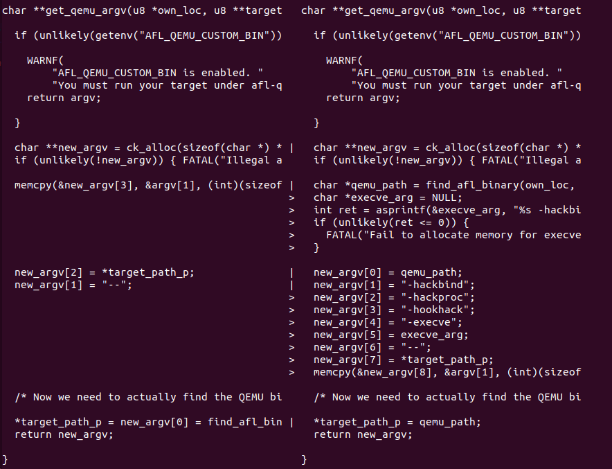
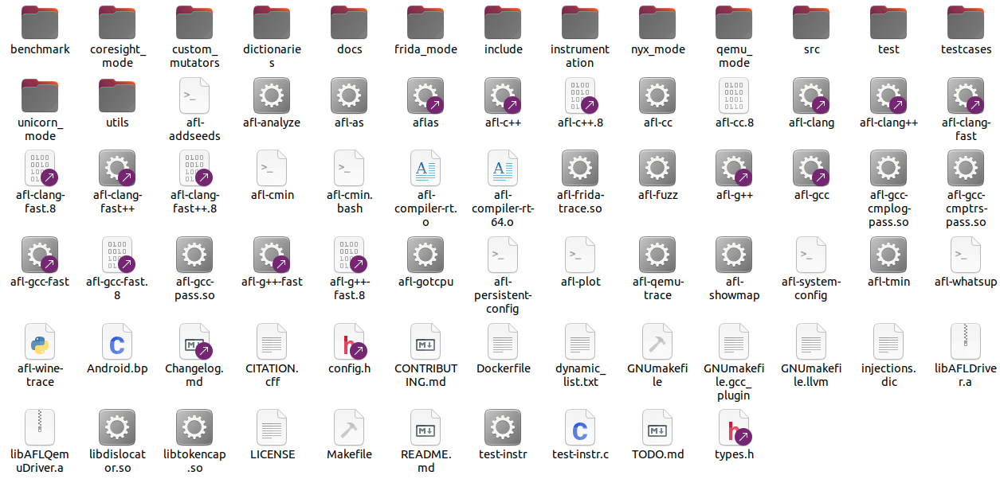
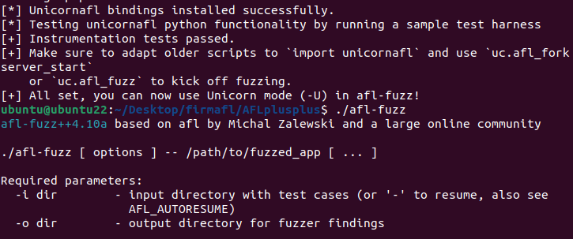
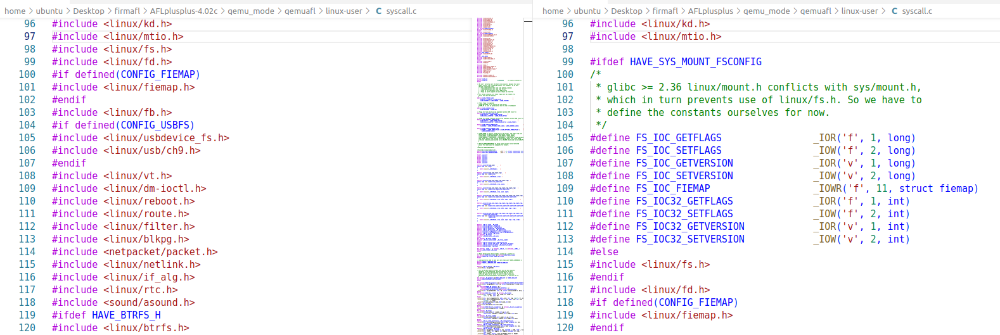

## make distrib
```bash
git clone https://github.com/AFLplusplus/AFLplusplus.git
```

greenhouse/gh3fuzz的afl-common.c与原始的区别就在于更改了get_qemu_argv()。



将新版的afl++的该文件中的这个函数替换掉，随后再重新编译。

```bash
STATIC=1 make distrib
```

随后遇到`as`问题
```bash
[+] Instrumented 665 locations (64-bit, non-hardened mode, ratio 100%).
afl-as++4.10a by Michal Zalewski

[-] PROGRAM ABORT : Endless loop when calling 'as' (remove '.' from your PATH)
         Location : main(), src/afl-as.c:636

make[1]: *** [GNUmakefile.llvm:399: instrumentation/afl-common.o] Error 1
make[1]: Leaving directory '/home/ubuntu/Desktop/firmafl/AFLplusplus'
make: [GNUmakefile:334: llvm] Error 2 (ignored)
[-] Compiling afl-cc failed. You seem not to have a working compiler.
make: *** [GNUmakefile:335: llvm] Error 1
```

这时因为当前目录的as与`/usr/bin/as`冲突了
```bash
ubuntu@ubuntu22:~/Desktop/firmafl/AFLplusplus$ which as
./as
ubuntu@ubuntu22:~$ which as
/usr/bin/as
ubuntu@ubuntu22:~/Desktop/firmafl/AFLplusplus$ $PATH
bash: /home/ubuntu/.local/bin:.:/usr/local/jdk-17.0.7/bin:/usr/local/jdk-17.0.7/lib:/usr/local/sbin:/usr/local/bin:/usr/sbin:/usr/bin:/sbin:/bin:/usr/games:/usr/local/games:/snap/bin:/home/ubuntu/.local/bin/:/snap/bin: No such file or directory
```

为此，我将AFL++中的`as`暂时改名为了`aflas`
```bash
ubuntu@ubuntu22:~/Desktop/firmafl/AFLplusplus$ ls -l as
lrwxrwxrwx 1 ubuntu ubuntu 6  1月  9 09:15 as -> afl-as
ubuntu@ubuntu22:~/Desktop/firmafl/AFLplusplus$ mv as aflas
ubuntu@ubuntu22:~/Desktop/firmafl/AFLplusplus$ ls -l aflas
lrwxrwxrwx 1 ubuntu ubuntu 6  1月  9 09:15 aflas -> afl-as
```

后面出现一些报错是因为没有装好环境
```bash
sudo apt-get update
sudo apt-get install -y build-essential python3-dev automake cmake git flex bison libglib2.0-dev libpixman-1-dev python3-setuptools cargo libgtk-3-dev
# try to install llvm 14 and install the distro default if that fails
sudo apt-get install -y lld-14 llvm-14 llvm-14-dev clang-14 || sudo apt-get install -y lld llvm llvm-dev clang
sudo apt-get install -y gcc-$(gcc --version|head -n1|sed 's/\..*//'|sed 's/.* //')-plugin-dev libstdc++-$(gcc --version|head -n1|sed 's/\..*//'|sed 's/.* //')-dev
sudo apt-get install -y ninja-build # for QEMU mode
```

最后就装好了。




最后再刚才改名的`aflas`还原为`as`。

## qemuafl
syscall.c


```c


#ifdef HAVE_SYS_MOUNT_FSCONFIG
/*
 * glibc >= 2.36 linux/mount.h conflicts with sys/mount.h,
 * which in turn prevents use of linux/fs.h. So we have to
 * define the constants ourselves for now.
 */
#define FS_IOC_GETFLAGS                _IOR('f', 1, long)
#define FS_IOC_SETFLAGS                _IOW('f', 2, long)
#define FS_IOC_GETVERSION              _IOR('v', 1, long)
#define FS_IOC_SETVERSION              _IOW('v', 2, long)
#define FS_IOC_FIEMAP                  _IOWR('f', 11, struct fiemap)
#define FS_IOC32_GETFLAGS              _IOR('f', 1, int)
#define FS_IOC32_SETFLAGS              _IOW('f', 2, int)
#define FS_IOC32_GETVERSION            _IOR('v', 1, int)
#define FS_IOC32_SETVERSION            _IOW('v', 2, int)
#else
#include <linux/fs.h>
#endif
```

```bash
ubuntu@ubuntu22:~/Desktop/firmafl/AFLplusplus$ diff qemu_mode/qemuafl/linux-user/syscall.c ../AFLplusplus-4.02c/qemu_mode/qemuafl/linux-user/syscall.c 
98,114d97
< 
< #ifdef HAVE_SYS_MOUNT_FSCONFIG
< /*
<  * glibc >= 2.36 linux/mount.h conflicts with sys/mount.h,
<  * which in turn prevents use of linux/fs.h. So we have to
<  * define the constants ourselves for now.
<  */
< #define FS_IOC_GETFLAGS                _IOR('f', 1, long)
< #define FS_IOC_SETFLAGS                _IOW('f', 2, long)
< #define FS_IOC_GETVERSION              _IOR('v', 1, long)
< #define FS_IOC_SETVERSION              _IOW('v', 2, long)
< #define FS_IOC_FIEMAP                  _IOWR('f', 11, struct fiemap)
< #define FS_IOC32_GETFLAGS              _IOR('f', 1, int)
< #define FS_IOC32_SETFLAGS              _IOW('f', 2, int)
< #define FS_IOC32_GETVERSION            _IOR('v', 1, int)
< #define FS_IOC32_SETVERSION            _IOW('v', 2, int)
< #else
116d98
< #endif

```