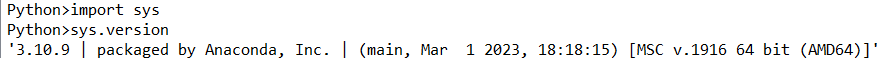
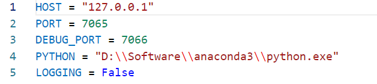
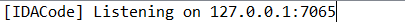
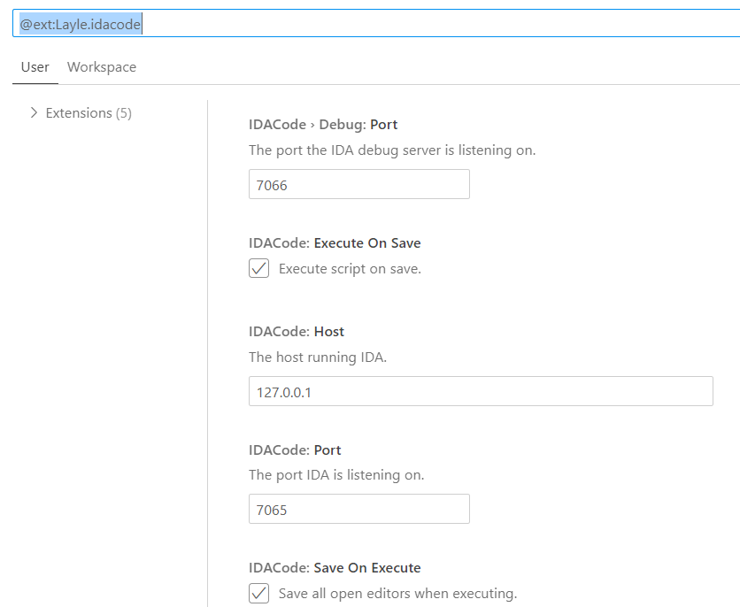
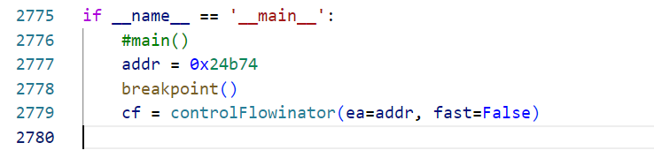
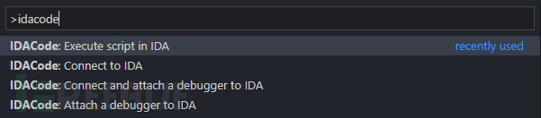
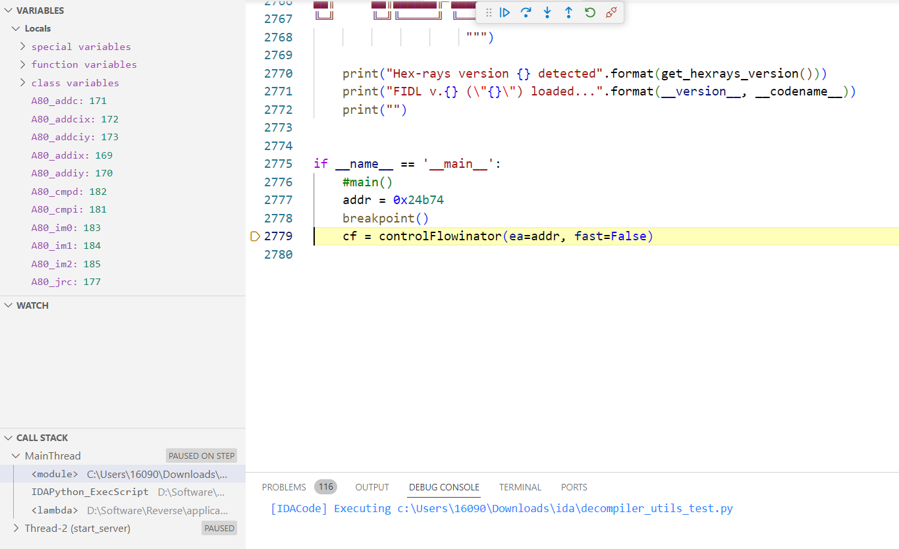

# IDA脚本动态调试
使用IDACode插件可以在VSCode中实现对IDA脚本的动态调试，详情可参考最后链接，这里记录我安装和使用的过程。

## 1.环境安装
1. 找到IDA所使用的python位置，然后运行
```
python -m pip install --user debugpy tornado
```

python的位置可以在IDA里运行`import sys; sys.version`查看python信息



2.从[Releases·ioncodes/idacode](https://github.com/ioncodes/idacode/releases)下载ida.zip到本地，解压将里面文件（`idacode_utils`文件夹和`idacode.py`）放到IDA的plugins目录下。

配置`idacode_utils`文件夹下的`settings.py`文件，主要是修改运行的PYTHON的位置，其它未做改动。



重新打开IDA，然后执行`Edit-->Plugins-->IDACode`，会出现如下提示就说明没问题。



3. 在VSCode上安装插件`IDACode`


然后设置保持默认就好



然后环境基本上就装好了。
## 2.使用
1. 创建一个脚本目录，然后在里面创建脚本，使用IDA打开该目录，打开文件，如果想设置断点，在代码行中写入`breakpoint()`，而非直接打断点。



2. 在IDA中开启IDACode：`Edit-->Plugins-->IDACode`，下方会提示开始监听


3.在VSCode上Ctrl+Shift+P，输入命令idacode，该工具提供了四个命令可以使用。



这时我们只要连接和附上debugger就可以进行调试了，其中会让你选择工作空间，选择默认的当前脚本目录就好。



IDACode默认开启"Execute on save"功能，当按Ctrl+S报错时，就会自动执行修改后的脚本。


## 参考文献
[如何通过IDACode与IDA和VS Code联调IDAPython脚本 - FreeBuf网络安全行业门户](https://www.freebuf.com/articles/system/323420.html)
[使用 VSCode 调试 IDAPython 脚本 - 字节时代 (byteage.com)](https://byteage.com/166.html)


