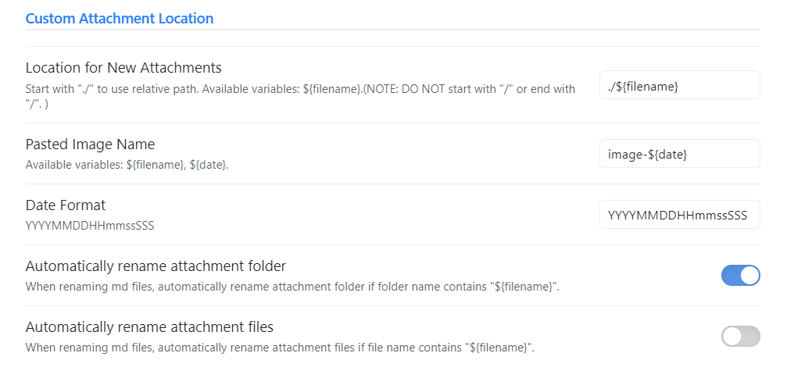
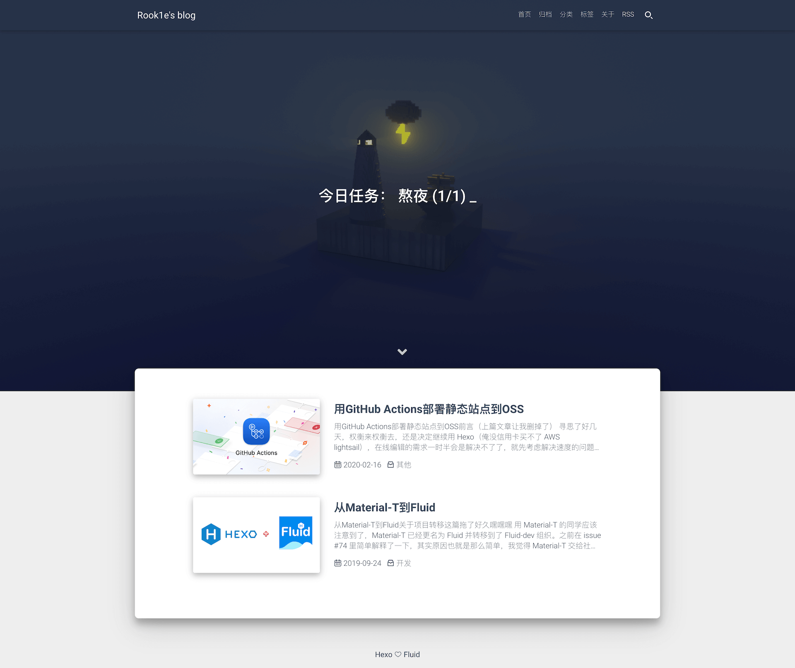

# Hexo静态博客搭建简记
最近想把自己的日常笔记好好整理一下发布到平台上便于观看和访问，我日常的记录习惯是一个文件夹内放一个md笔记，同时包含一个images文件夹用于存放图片，我希望我做的笔记能直接转换为易于观看访问的在线页面，于是我又重新搭建起了github+hexo这个免费的基于markdown的静态博客，这中间需要解决图片链接问题，我在这里记录一下大概的过程和遇到的问题与解决方法。

## 1.blog搭建
### 1.1 环境安装和博客搭建
首先根据hexo的官方文档[Hexo Doc](https://hexo.io/docs/)安装git和node.js，利用npm命令安装hexo。
```
npm install -g hexo-cli
```

然后创建博客文件夹github-blog
```
hexo init github-blog
cd github-blog
npm install
```

随后可以根据文档[Configuration](https://hexo.io/docs/configuration)，修改`_config.yml`文件进行配置，主要是Site和URL部分。

### 1.2 图片设置
文章的写作是将md文档放在`source/_posts`文件夹下。

为了便于将我笔记的md文档和images图片可以拷贝过去直接使用，在`_config.yml`中，将`post_asset_folder`选项打开，我尝试了[Asset Folders](https://hexo.io/docs/asset-folders)中提到的方法但都无效，图片不能正常加载出来，`hexo d`命令后图片的链接没有改变。
```
post_asset_folder: true
```

网上的很多答案都不管用，在经历许久的尝试与搜索后，终于发现[hexo-asset-image-for-hexo5](https://www.npmjs.com/package/hexo-asset-image-for-hexo5)这个工具可以解决图片问题。
```
npm install hexo-asset-image-for-hexo5 --save
```

如下所示，我只需要创建一个同名文件夹来存放图片，使用``方式来引用图片，在生成的时候，它会自动的调整url链接从而正常显示。
```
├─Data-Structure
├────diagram.png
└─Data-Structure.md
```

### 1.3 Obsidian设置
我使用的是Obsidian来做笔记，为了将图片自动存储在md同名的文件夹下，需要安装`Custom Attachment Location`插件，可以参考文章：[如何让Obsidian的图片存储形式设置为 ./${filename}.assets](https://www.cnblogs.com/yangstar/articles/17060727.html)。

1. 首先在Obsidian上安装`Custom Attachment Location`插件。
2. 设置插件的Location for New Attachments为`./${filename}`


3. Obsidian上的选项`文件与链接-附加默认存放路径`设置为`当前文件所在文件夹下指定的子文件夹中`即可。

## 2.更换Fluid主题
Hexo提供了很多主题可以选择更换：[Themes](https://hexo.io/themes/)，我选择的是[fluid](https://github.com/fluid-dev/hexo-theme-fluid)主题，它的文档位于[Hexo Fluid 用户手册](https://hexo.fluid-dev.com/docs/start/)。



使用该主题方法如下：

1.首先需要按照上面创建Hexo博客

2.获取按照Fluid主题

进入到博客目录，执行下面命令按照
```
npm install --save hexo-theme-fluid
```

3.修改_config.yml指定为fluid主题
```yaml
theme: fluid  # 指定主题
language: zh-CN  # 指定语言，会影响主题显示的语言，按需修改
```

4.可以创建关于页
```
hexo new page about
```

创建成功后修改`/source/about/index.md`，添加`layout`属性。如下

```
---
title: 标题
layout: about
---

这里写关于页的正文，支持 Markdown, HTML
```

其它设置可以根据文档提示操作。

## 3.部署到Github上
详细的安装过程都可以在网上找到，包括配置git、创建博客项目等等，我之前已经创建过了，我这里只记录我感兴趣的一部分。

为了同步到github上，在`_config.yml`中最下面进行配置，type选`git`，repo为博客项目的git链接，branch为分支。

```
deploy:
  type: 'git'
  repo: https://github.com/C0ngvv/C0ngvv.github.io.git
  branch: master
```

然后按理说输入`hexo d`就可以了，但失败了提示：
```
ERROR Deployer not found: git
```

经过在网上搜索，需要安装`hexo-deployer-git`插件:
```
npm install --save hexo-deployer-git
```

然后就可以`hexo d`上传了，中间它会提示你进行github认证。

## 4.基本使用方法和命令
### 4.1 编写博客
将新博客md文档放在在`source/_posts`目录下（文档也可以放在该目录下不同类别的文件夹便于管理），并创建同名文件夹来保存图片。

md文档中通过`title`指定标题（发现必须指定，不然首页没标题..），`date`指定日期，`categories`指定类别，`tags`指定标签。例如：

```
---
title: Hello World
date: 2023/11/25
categories:  
- Sports  
- Baseball  
tags:  
- Injury  
- Fight  
- Shocking
---
```

Hexo似乎也支持有层次的类别：
```
categories:
- [Sports, Baseball]
- [MLB, American League, Boston Red Sox]
- [MLB, American League, New York Yankees]
- Rivalries
```

在Obsidian中也可以设置模板来直接生成包含这些内容的文件。

### 4.2 生成页面
输入`hexo g`来生成页面。

### 4.3 本地测试
输入`hexo s`来生成本地服务器，可以看页面是否正常。

### 4.4 部署github
输入`hexo d`来将更新同步到github上。