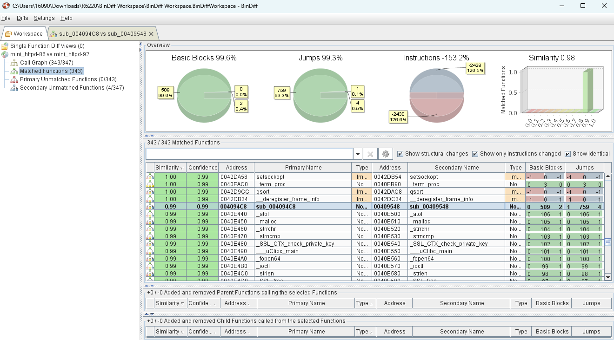
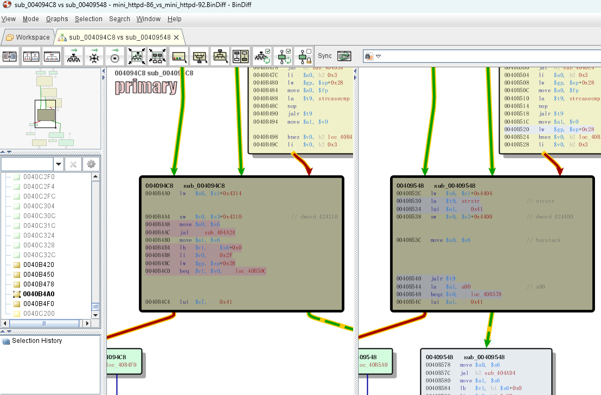

CVE: [CVE - CVE-2019-17137 (mitre.org)](https://cve.mitre.org/cgi-bin/cvename.cgi?name=CVE-2019-17137)

## 固件获取
固件下载（[美国网件(NETGEAR) - 技术支持](http://support.netgear.cn/doucument/More.asp?id=2294)）：

[1.1.0.086](http://www.downloads.netgear.com/files/GDC/R6220/R6220-V1.1.0.86.zip)（有漏洞）

[1.1.0.092_1.0.1](http://support.netgear.cn/Upfilepath/R6220-V1.1.0.92_1.0.1_BETA.img)（修复）

下载后使用binwalk提取。

## bindiff分析
将两个版本的mini_httpd导入到bindiff进行分析。

在sub_004094C8 vs sub_00409548中，查看黄色代码块，在0040B4A0中发现了a00。

## 参考链接
[Netgear R6220 认证绕过漏洞分析 - 知乎 (zhihu.com)](https://zhuanlan.zhihu.com/p/343918187)

